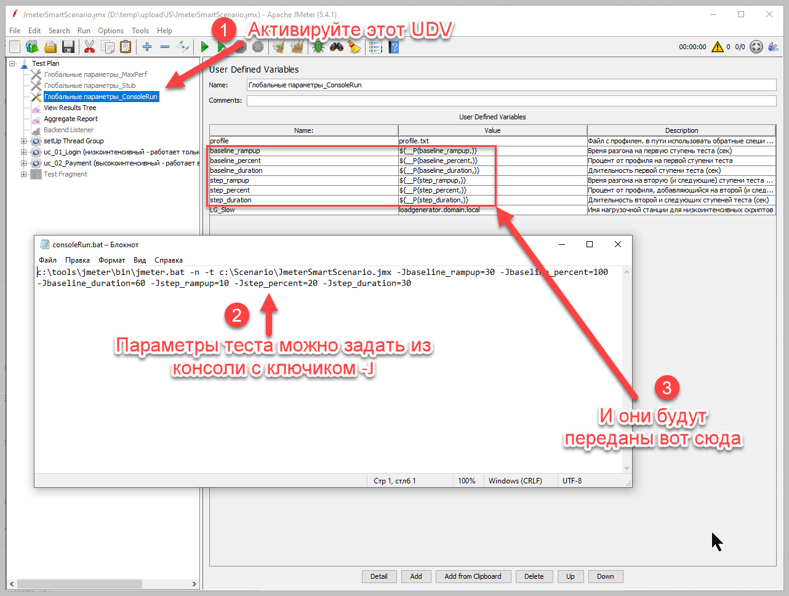

# JmeterSmartScenario

## [(Русская версия описания доступна по этой ссылке)](./README-RUS.md)

This module allows you to change the parameters of your Jmeter test in two clicks.
Before running the test, it is enough to check (and, if necessary, change) the following variables:

First stage of the test:
1) RampUp time to the first stage of the test
2) Profile percentage at the first stage of the test
3) Duration of the first stage of the test

Other stages of the test:

4) RampUp time for each next test stage
5) Profile percentage added at each subsequent test step
6) Duration of each next test step

After that, run the test and enjoy the results.

# Why do you need it?
We run a lot of tests.
Most often these are "Search for Maximum Performance" tests.
This means that we must increase the load on the system until the SLA (usually response time or error rate) are violated.
But most of the systems we test are already used in production. Or this is not the first time we are testing them.
This means that we already know: the system is able to hold the load at X operation per second. But how much more load the system can withstand is a question that needs to be answered during the test.
For a tester, this means that the test should start by applying the load that the system can obviously handle (for example, 100% of the productive load) - and “step up” to the top.

It is also worth explaining why I increase the load in steps: the fact is that sometimes the system’s performance does not change immediately after increasing the load, but with some delay. Test sections with a stable load are better suited for analyzing the behavior of the system under such load.  
In addition, we are often not at all interested in how the system behaves under increasing load, because in production the load usually increases within a few hours. However, in tests we increase the load much faster, and, as a result, we do not analyze the behavior of the system at the moment of acceleration by steps. On the contrary, we analyze only part of the load steps - when the operation of the system has stabilized after an increase in load (and for studies of rapid load growth, a separate type of test is used - stress tests).

But although our tests are similar, they are often different:
* The new release of the system under test has become more productive, and now the test can be started immediately with 150% of the productive load.
* The requirements for the accuracy of the results have increased, and now we need steps not by 10% of the profile, but by 5%. Or vice versa, 20%.
* The system takes a long time to stabilize, and it is necessary to increase the duration of the steps from 5 to 15 minutes
* and so on...

Previously, every time we needed a new test, we had to calculate and change many settings in the Jmeter test plans.
It was long and inconvenient, and each time there was a possibility of human error.

Using JmeterSmartScenario, you just need to specify the parameters of THIS test - and all the required settings will be calculated automatically, and you just have to watch the progress of the test.

# But Open Model Thread Group does the same. In which cases do we need your solution?
The "[Open Model Thread Grpoup](https://jmeter.apache.org/usermanual/component_reference.html#Open_Model_Thread_Group)" simulate OPEN MODEL. This means that each iteration is the "first iteration of a new user" (all data will be lost between iterations). 
For Jmeter, this means that elements like **Once Only Controller** will be executed at each iteration, and the **Cookie/Cache managers** will clean their data at each iteration.
If these conditions contradict your test model, try to use my solution.

# How it works?
After running the test, setUp Thread Group is triggered, containing a Groovy script that:
1) Reads a file **“profile.txt”**, which contains constant parameters:
* Operation name
* Number of operations per hour for 100% profile
* The time during which the operation can be completed (it should be specified with a margin, since the execution time usually increases under load)
* The number of load generators from which this operation will be performed (I will talk about this below in more details).

2) The number of threads required to supply a given load is calculated, as well as the intensity with which each thread must work. The calculated parameters are placed in Property with names consisting of the operation name and suffix:
* useCase_start - number of threads in the first stage of the test
* useCase_add_thread - number of threads added at each test stage
* useCase_throughtput - number of operations performed per minute by each thread

Parameters that are the same for all thread groups are also calculated and placed in Property:

* #_init_delay - time from the start of the test to the start of each test stage. # means number of stage.
* #_length - time from the beginning of each stage to the end of the test. # means number of stage.

3) These elements are used in the test plan settings:
* To control the number of threads, the Ultimate Thread Group is used (installed as part of the Custom Thread Groups plugin )
* To control the intensity of each thread, a Constant Throughput Timer is used (part of Jmeter)

# How do I start using "JmeterSmartScenario"?
1) Install UltimateThreadGroup (I recommend installing [JmeterPluginManager](https://jmeter-plugins.org/wiki/PluginsManager/), and it will download the necessary plugins when you open the test plan)
2) Download the following files into one folder:
* **JmeterSmartScenario.jmx** (the example provided uses 2 thread groups)
* **profile.txt**

3) Open the **profile.txt**, enter your data: to begin with, I suggest leaving the operation names as they are, and enter the rest of the parameters as yours:
* Rate (operation per hour)
* Operation response time (in seconds)
* Number of load generators (if you do NOT have a distributed test, enter 1)

4) Open **JmeterSmartScenario.jmx** and specify the path to the profile.txt file. Please note that you must use a forward slash (for example: c:/jmeter/profile.txt).
5) In the example thread groups "uc_01_Login" and "uc_02_Payment" below the "Flow Action Control" sampler, add your samplers, transactions, and so on.
By the way, I save all the scripts in separate files as “Test Fragment”, and in JmeterSmartScenario.jmx I add only the Include Controller, which refers to the file with a specific script. This allows me to use them in different scenarios and reuse the code.

# Ok, how can I add new thread groups to "JmeterSmartScenario"?
Ooh. I haven’t come up with a convenient enough method myself.

The procedure is as follows:
1) Add a line to the **profile.txt**, specify YOUR profile information (separated by commas).
2) Copy and paste one of the existing thread groups (it’s better to rename it right away)
3) In the UltimateThreadGroup settings, change the prefix in the variable name in the "Start Thread Count" column: specify the operation name as it is written in the profile.txt file. Leave the **_start** and **_add_thread** suffixes. Please note: It doesn’t matter what the thread group itself is called!
4) Expand the tree: [ thread group => Flow Control Action => Constant Throughput Timer ], change the prefix in the variable name: specify the name of the operation as it is written in the **profile.txt** file. Leave the **_throughtput** suffix.

([here is a video of the process in good quality](https://github.com/ganeles/JmeterSmartScenario/raw/main/images/newScript.mp4))

# How to run a stability test (without steps)?
Simply set the parameters describing the operation of the steps to zero. 
JmeterSmartScenario has an example: a disabled User Defined Variable module named **Global Parameters_Stub**.

In general, you can keep several **User Defined Variables** with different parameters and turn them on and off as needed.
The main thing is that only one is turned on at a time.
I have different UDVs even refer to different **profile.txt** files: last year’s profile, this year’s profile, a profile describing the workload of the Black Friday....

# What about distributed tests?
Jmeter is designed in such a way that when a distributed test is launched, the same JMX file is launched on all jmeter-servers.
This must be taken into account when calculating parameters: after all, two generators will supply twice as much load as one.
For this purpose, use the parameter in the **profile.txt** file - the load rate (operation per hour) will be divided by the number of generators, so that all of them together supply the required load.

# How to run a test from the console?
Everything is the same, just the parameters do not need to be entered into the User Defined Variable module, but rather transferred when running the test.
Well, in the User Defined Variable you need to accept the parameters passed at startup :)
I prepared everything:
1) Activate the User Defined Variable module, which is called "Global Parameters_ConsoleRun", and disable the rest of the similar UDVs.
2) When running the test, specify all the same parameters using the -JParameterName key (**-Jbaseline_duration** for example).

An example of such a launch is in the file **consoleRun.bat**

# There are only 7 steps in the test. I want more/less!
If you need **less** steps, just remove the extra lines from each UltimateThreadGroup.  

If you need **more** steps, you need to add lines in each UltimateThreadGroup, adjusting the variable names according to the number of the step.
In addition, you will need to modify the groovy script that calculates the test parameters so that it calculates everything you need.
Now the number of steps is hardcoded because to change the number of steps you still need to manually change the UTG settings. 

# What are these disabled elements inside the Once Only Controller?
These are things that help me a lot in my work, but may not be useful to you.

1) RandomPause (to prevent many threads from starting work at the same time). When running a test, it may happen that many threads start at the same time.
This results in the system load being unevenly distributed across the test: 
* First, all threads perform operations;
* Then they all wait for the **Constant Throughput Timer** to run;
* Then again everyone performs the operation together;

This distorts the test results.
To avoid such situations, I added a random pause: for each thread, it delays the execution of the FIRST iteration for a random time in the range from 0 to 30 seconds.
As a result, the load on the system becomes more uniform, because now the threads start working at different times, which means that all their next iterations must be executed at different times.

2) **Low-intensity script (only on LG_Slow)** и **High-intensity script (Everywhere except LG_Slow)**.

This applies ONLY to distributed tests: if one script in a scenario has a very low intensity, and another has a very high intensity, it turns out that:
* On the one hand, due to the high-intensity script, we have to use a distributed test (one generator cannot perform entire load)
* On the other hand, a script that already works with low intensity will be “spread out” across several generators. And this is not very good: the less load there is on each generator, the more threads will supply this load (relevant for tests with steps). The more threads supply it, the less frequently they perform operations.

For example, if:
* Basic intensity = 100 operations per hour
* During the test, you first need to apply 100% of the load and then increase the load to 160% in steps of 10% (that is, make steps of 100%, 110%, 120%, 130%, 140%, 150%, 160%)
* The operation time is no more than 10 seconds
* We run the test from 1 load generator

It turns out that:
* We will need 16 threads (10 threads supply 100% of the load, and 6 times we add 1 thread to increase the load by 10%)
* Each thread will perform operations once every 6 minutes.

If there are two generators, the number of threads will double, which means the frequency of operations will drop by half (each thread will perform operations once every 12 minutes).
This means that the length of the test steps must be at least 12 minutes, otherwise the load will increase unevenly.

What to do? I solved this problem as follows:
1) I allocate one jmeter-server for running all “low-intensity” scripts.
2) All scripts run on all jmeter-servers
3) BUT! When each thread is launched, the Once-only Controller executes once, which checks whether this script should work on this jmeter-server. If yes, everything is fine. And if not, the thread stops immediately after starting.
4) The computer name for jmeter-server, dedicated for "low-intensity" scripts, is specified in the UDV in the "LG_Slow" parameter (LG stands for Load Generator)

## History of changes
2021-07-25
* Removed dependency on Dummy Sampler
* Added a groovy script directly to the test plan (to reduce problems with specifying file paths)
2023-12-24
* Added English version of ReadMe
