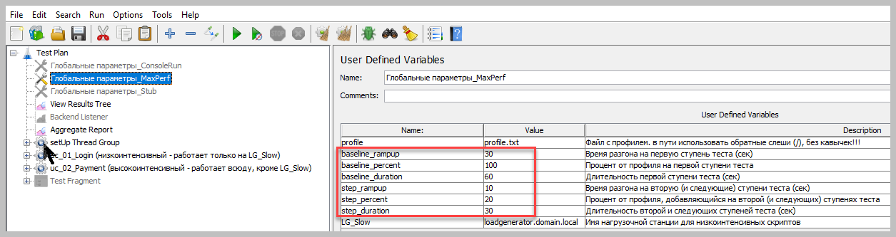
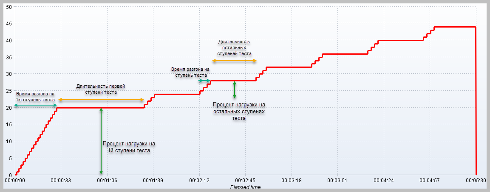
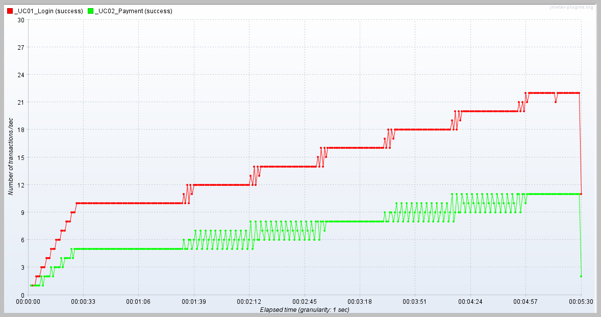
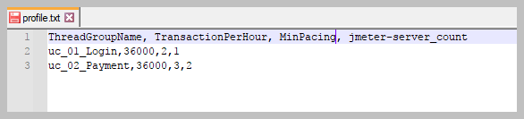
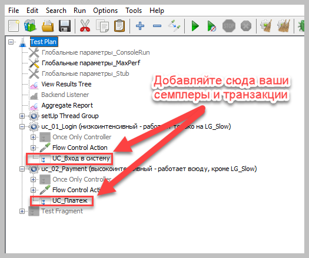
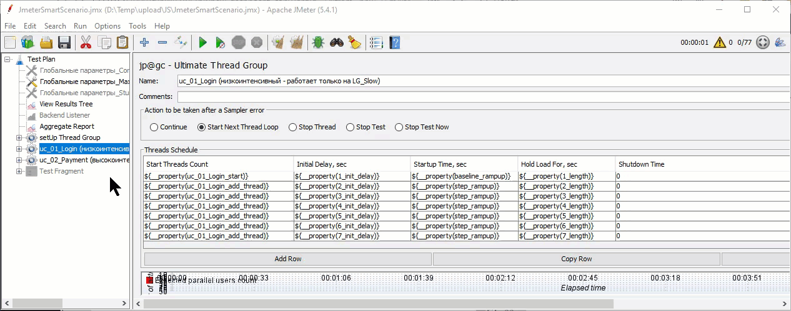

# JmeterSmartScenario

Этот модуль позволяет "в два клика" менять параметры вашего Jmeter-теста.  
Достаточно перед запуском теста проверить (а при необходимости - изменить) следующие переменные:  

Первая ступень теста:
1) Время разгона на первую ступень теста
2) Процент профиля на первой ступени теста
3) Длительность первой ступени теста
  
Остальные ступени теста:

4) Время разгона на каждую следующую ступень теста
5) Процент профиля, добавляющийся на каждой следующей ступени теста
6) Длительность каждой следующей ступени теста

После этого запустить тест, и наслаждаться результатами.

# Зачем это нужно?
Мы запускаем множество тестов.
Чаще всего это тесты на "Поиск максимальной производительности"
Это означает, что мы должны увеличивать нагрузку на систему до тех пор, пока не будут нарушены критерии успешной работы системы (обычно это время отклика или процент ошибок).
Но большинство систем, которые мы тестируем уже используются на проде. Или мы тестируем их не в первый раз.
А это значит, что мы и так знаем: нагрузку на уровне Х система держит. А вот насколько бОльшую нагрузку выдержит система - это вопрос, ответ на который нужно найти в ходе теста.
Для тестировщика это означает, что тест должен начаться с подачи той нагрузки, с которой система заведомо справляется (например, с 100% продуктивной нагрузки) - и "шагать" наверх.
Также стоит объяснить, почему мы увеличиваем нагрузку ступеньками: дело в том, что иногда показатели системы меняются не сразу после увеличения нагрузки, а с некоторой задержкой. Участки теста с стабильной нагрузкой лучше подходят для анализа поведения системы под такой нагрузкой.
С другой стороны, зачастую нам бывает и вовсе не интересно, как ведёт себя система под возрастающей нагрузкой, ведь на проде нагрузка обычно увеличивается в течение нескольких часов, а в тестах мы увеличиваем нагрузку гораздо быстрее, и, как следствие, вовсе не анализируем поведение системы в момент разгона на ступеньки - даже наоборот, анализируем только часть ступенек нагрузки - когда работа системы стабилизировалась после увеличения нагрузки (а для исследований быстрого роста нагрузки служит отдельный вид тестов - стресс-тесты).

Но, хотя наши тесты похожы, они зачастую отличаются: 
* Новый релиз тестируемой системы стал более производительным, и теперь тест можно начинать сразу с 150% продуктивной нагрузки. 
* Увеличились требования к точности результатов, и теперь нам нужны ступеньки не по 10% профиля, а по 5%. Или наоборот, по 20%.
* Система долго стабилизируется, и нужно увеличить длительность ступенек с 5 до 15 минут
* и так далее...

Раньше каждый раз, как нам был нужен новый тест - приходилось менять множество настроек в тест-планах Jmeter. 
Это было долго и неудобно, кроме того каждый раз была вероятность человеческой ошибки.

С использованием JmeterSmartScenario достаточно указать параметры ДАННОГО теста - и все требуемые параметры будут рассчитаны автоматически, а вам остаётся только наблюдать за ходом теста.

# Как это работает?
После запуска теста отрабатывает setUp Thread Group, содержащая Groovy-скрипт, который:
1) Считывает построчно файл с "профилем", в котором указаны постоянные параметры:
* Имя операции
* Количество операций в час для 100% профиля
* Время, за которое операция успевает выполниться (стоит указывать с запасом, т.к. под нагрузкой время выполнения обычно увеличивается)
* Количество генераторов нагрузки, с которых будет выполняться эта операция (об этом я расскажу подробнее ниже).

2) Расчитываются количество потоков, необходимых для подачи заданной нагрузки а также интенсивность, с какой должен работать каждый VU.
Расчитанные параметры кладутся в Property с именами, состоящими из имени операции и суффикса:

* threadGroup_start - количество потоков на первой ступени теста
* threadGroup_add_thread - количество потоков, добавляемых на каждой ступени теста
* threadGroup_throughtput - количество операций, выполняемых в минуту каждым потоком

Также расчитываются и кладутся в Property параметры, одинаковые для всех тред-групп:
* #_init_delay - времени с момента старта теста до начала каждой ступени теста
* #_length - время с начала каждой ступени до конца теста

3) Эти параметры используются в настройках тест-плана:
* Для управления количеством потоков используется Ultimate Thread Group (устанавливается в составе плагина [Custom Thread Groups](https://jmeter-plugins.org/wiki/UltimateThreadGroup/))
* Для управления интенсивностью работы каждого потока используется Constant Throughput Timer (входит в состав Jmeter)

# Как мне начать использовать "JmeterSmartScenario"?
1) Установите UltimateThreadGroup (советую поставить [JmeterPluginManager](https://jmeter-plugins.org/wiki/PluginsManager/), и он сам скачает необходимые плагины при открытии тест-плана)
2) Скачайте в одну папку файлы 
* **JmeterSmartScenario.jmx** (в предоставленном примере используются 2 тред-группы)
* **calc_test_param.groovy**
* **profile.txt**

3) Откройте файл **profile.txt**, укажите ваши параметры: имена операций для начала предлагаю оставить их как есть, а остальные параметры укажите ваши:
* Интенсивность (оп/ч)
* Время выполнения операций (в секундах)
* Количество генераторов нагрузки (если у вас НЕ распределённый тест - укажите 1)

4) Откройте **JmeterSmartScenario.jmx**, и после семплера "Flow Action Control" добавьте свои семплеры, транзакции и так далее.  
Кстати, я все скрипты сохраняю в отдельные файлы как "Test Fragment", а в JmeterSmartScenario.jmx добавляю только Include Controller, ссылающийся на файл с конкретным скриптом. Это позволяет мне использовать их в различных сценариях и переиспользовать код.  

# Ок, а как мне добавить новые тред-группы в "JmeterSmartScenario"?
Оох. 
Достаточно удобного способа я и сам не придумал.

Порядок действий такой:
1) Добавьте строчку в файл **profile.txt**, укажите все параметры через запятую.
2) Скопируйте и вставьте одну из имеющихся тред-групп (лучше сразу переименовать её)
3) В настройках UltimateThreadGroup измените префикс в имени переменных в столбце "Start Thread Count": укажите имя операции так, как оно написано в файле profile.txt. Суффиксы \_start и \_add_thread оставьте. 
Обратите внимание! Как  называется сама тред-группа - не важно!

([вот видео процесса в хорошем качестве](https://github.com/ganeles/JmeterSmartScenario/raw/main/images/newScript.mp4))

4) Разверните дерево: [ тред-группа => Flow Control Action => Constant Throughput Timer ], измените префикс в имени переменной: укажите имя операции так, как оно написано в файле profile.txt. Суффикс \_throughtput оставьте.

# Как запустить тест стабильности (без ступенек)?
Просто приравняйте к нулю параметры, описывающие работу ступенек.
В JmeterSmartScenario есть пример: отключённый модуль User Defined Variable с именем **Глобальные параметры_Stub**

Вообще, можно держать несколько User Defined Variable с разными параметрами, и включать-выключать их по необходимости.  
Главное, чтобы одновременно был включён только один.

# Что по поводу распределённых тестов?
Jmeter так устроен, что при запуске распределённого теста, на всех jmeter-server запускается один и тот же JMX-файл.  
Это нужно учитывать при расчёте параметров: ведь с двух генераторов будет подаваться вдвое больше нагрузки, чем с одного.  
Для этого служит параметр в файле **profile.txt** - интенсивность нагрузки (оп/ч) будет разделена на количество генераторов, чтобы все вместе они подали нужную нагрузку.

# Как запустить тест из консоли?
1) Активируйте модуль User Defined Variable, который называется "Глобальные параметры_ConsoleRun", а остальные аналогичные UDV отключите
2) При запуске теста укажите все теже параметры с использованием ключа -JимяПараметра. 

Пример такого запуска есть в файле **consoleRun.bat**

# В тесте только 7 ступенек. Хочу больше / меньше!
Если нужно **меньше** ступенек - достаточно удалить лишние строчки из каждой UltimateThreadGroup.  

Если нужно **больше** ступенек - нужно добавить строки в каждой UltimateThreadGroup, корректируя имена переменных в соответствии с номером ступени.
Кроме того, потребуется доработать файл, расчитывающий параметры теста (**calc_test_param.groovy**) так, чтобы он расчитывал всё, что вам требуется.  
Сейчас количество ступенек захардкожено потому, что всё равно для изменения количества ступеней нужно вручную менять настройки UTG.

# А что это за отключённые элементы внутри Once Only Controller?
Это штуки, которые здорово помогают мне в моей работе, но может и не пригодятся вам.  

1) RandomPause (чтобы много потоков не начинали работу в один момент)
При запуске теста может так сложиться, что много потоков стартуют одновременно.
Это приводит к тому, что нагрузка на систему неравномерно распределяется по тесту:
* сперва все потоки выполняют операции
* потом все они ждут, пока отработает Constant Throughput Timer
* потом опять все вместе выполняют операцию
Это искажает результаты теста.  
Чтобы избежать таких ситуаций я добавил паузу рандомную паузу: для каждого потока она задерживает ПЕРВОЕ выполнение итерации на случайное время в промежутке от 0 до 30 секунд.
В результате нагрузка на систему становится более равномерной, ведь теперь потоки начинают работать в разное время, а значит и все следующие их итерации должны выполняться в разные моменты.

2) **Низкоинтенсивный скрипт (только на LG_Slow)** и **Высокоинтенсивный скрипт (только на LG_Slow)**
Это касается ТОЛЬКО распределённых тестов: если у одного скрипта в сценарии очень низкая интенсивность, а у другого - очень высокая - получается, что:
- С одной стороны, из-за высокоинтенсивного скрипта нам приходится использовать распределённый тест (один генератор не справляется)
- С другой стороны, скрипт, который и так работает с низкой интенсивностью, будет "размазан" по нескольким генераторам. А это не очень хорошо: чем меньше нагрузки придётся на каждый генератор, тем больше потоков будут эту нагрузку подавать. Чем больше потоков её подают, тем реже они выполняют операции.  
Например, если:
* Базовая интенсивность = 100 операций в час
* В ходе теста нужно увеличивать нагрузку ступеньками по 10%
* Время выполнения операции не больше 10 секунд
* Мы запускаем тест с 1 генератора нагрузки

Получится, что:
* Нам потребуется 16 потоков (10 потоков подают 100% нагрузки и 6 раз мы добавляем по 1 потоку чтобы увеличить нагркузку на 10%)
* Каждый поток будет выполнять операции раз в 6 минут. 

Если же генераторов будет два - количество потоков увеличится вдвое, а значит частота выполнения операций вдвое упадёт (каждый поток будет выполнять операции раз в 12 минут).  
Это значит, что длина ступеней теста должна быть не менее 12 минут, иначе нагрузка будет наращиваться неравномерно.  

Что же делать?
Я решил эту проблему следующим образом:
1) Выделяю один jmeter-server для работы "низкоинтенсивных" скриптов.
2) Все скрипты запускаются на всех jmeter-server
3) НО! При запуске каждого потока один раз отрабатывает Once-only Controller, который проверяет - а должен ли этот скрипт работать на этом jmeter-server. Если да - всё в порядке. А если нет - поток останавливается сразуже после запуска.

